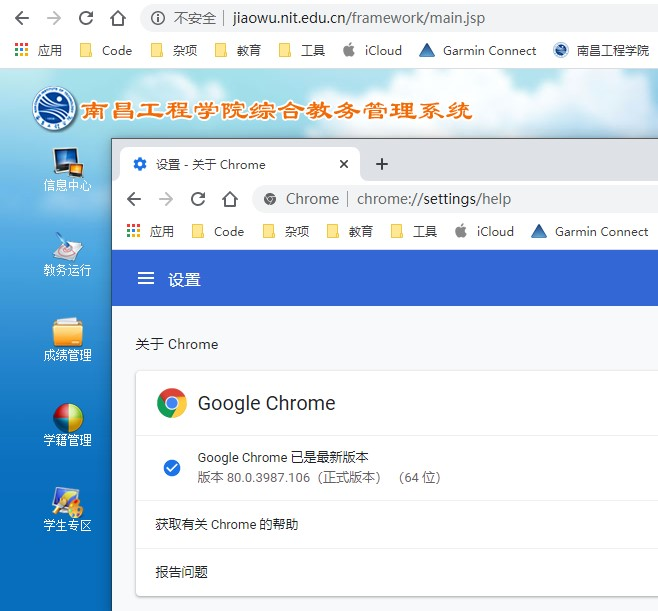
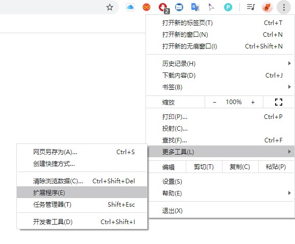

## NIT教务系统修复插件

解决非IE内核访问教务处出现无法创建对象、权限认证失败等问题。  
有问题请联系jiabi@nit.edu.cn

#### 效果图：




#### 使用指南：

1、下载[release](https://github.com/JiaBiNiang/nit_jw_repair/files/4205290/nit_jw_repair.zip)或[百度云:h3bk](https://pan.baidu.com/s/16JCMknHMbfZP7sZz2xRUdg)中的nit_jw_repair.zip文件并解压

2、找到Chrome设置->扩展程序。



3、在页面右上角打开开发者模式


4、选择加载已解压的扩展程序，选中解压后的nit_jw_repair目录即可


Tips：  
```diff
-第一次使用会显示UnknownProblems，刷新或者重新进一下教务系统即可   
```
最近作者发现了一家价格便宜速度又快的机场  
如果你也想飞快地科学上网 ~~(翻墙)~~ 的话，就吃我一记[aff(邀请链接)](https://pud.life/aff/DD21)吧！  
YouTube 4K60 无压力


#### 致谢：

本插件并非作者原创  
感谢东北师范大学 [Efly Studio](https://github.com/EflyStudio/nenu-jwc-repair) 提供的JS脚本。  
感谢中国石油大学(华东)[busymx](https://github.com/busymx/upc-jwxt-repair)提供的参考。
